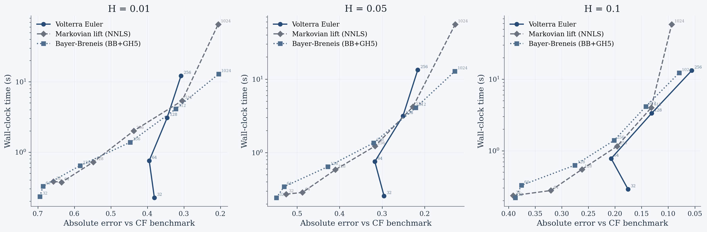
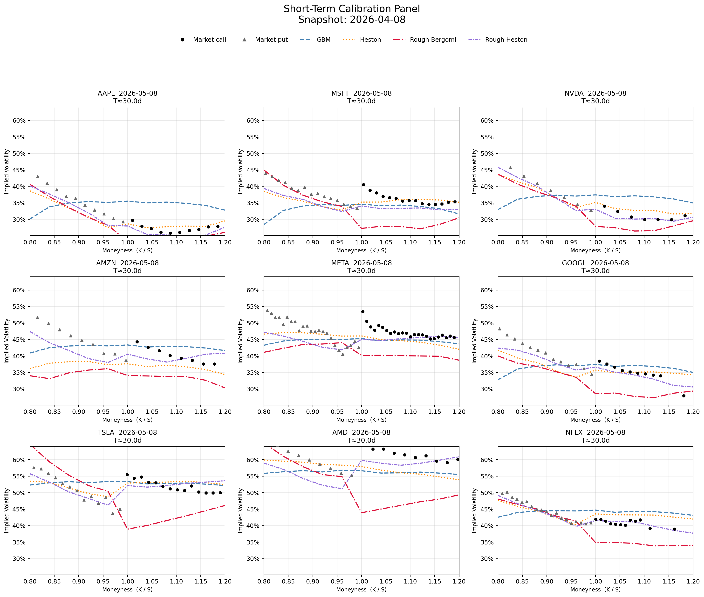

# Rough Pricing

A self-contained Python research lab for **derivative pricing and calibration under stochastic and rough volatility models**. The project is intentionally experimental: simulation, analytics, calibration, and empirical roughness estimation for studying where rough volatility adds practical value over classical models.

## Models

| Model | Schemes | Calibration |
|---|---|---|
| GBM | exact log-Euler | yes |
| Heston | Euler full-truncation | yes |
| Rough Bergomi | `volterra-midpoint` · `blp-hybrid` · `exact-gaussian` | yes |
| Rough Heston | `volterra-euler` · `markovian-lift` · `bayer-breneis` | yes |

All models implement the `PathModel` protocol and run through the unified `MonteCarloEngine`. See [`kernels/rough_model_sim.md`](src/roughvol/kernels/rough_model_sim.md) for the mathematical reference.

### Rough Bergomi schemes

| Scheme | Complexity | Notes |
|---|---|---|
| `volterra-midpoint` | O(n²) | Midpoint Volterra quadrature; mild singularity bias |
| `blp-hybrid` | O(n log n) | Bennedsen-Lunde-Pakkanen: near-field exact + far-field FFT; default for calibration |
| `exact-gaussian` | O(n³) precomp | Cholesky of joint RL-fBM covariance; benchmark quality |

### Rough Heston schemes

| Scheme | Complexity | Notes |
|---|---|---|
| `volterra-euler` | O(n²) | Direct Volterra history accumulation; positivity by clipping |
| `markovian-lift` | O(N·n) | N-factor sum-of-exponentials kernel; exponential integrator for stability |
| `bayer-breneis` | O(N·n) | Order-2 weak scheme: 3-point Gauss-Hermite innovation + Strang splitting for log-spot; arXiv:2310.04146 |

## Findings

### Simulation scheme efficiency

The right scheme depends on H. Each panel below fixes H and plots wall-clock time against absolute pricing error relative to the characteristic-function benchmark.

**H = 0.1** (mildly rough): Volterra-Euler dominates. Its exact kernel accumulation incurs no Markovian approximation error, reaching sub-0.06 error at n = 256 steps — below the factor floor that limits the Markovian-lift schemes even at n = 1024.

**H = 0.01** (extremely rough): the picture inverts. The kernel K(t) ~ t^{-0.49} is nearly maximally singular; Volterra-Euler stalls above 0.3 error at any tested step count because the O(n²) cost makes a fine enough grid prohibitive. Markovian-lift and Bayer-Breneis converge monotonically and reach comparable error 3× faster.

**H = 0.05** (transition regime): both families are competitive. This is the roughness range most commonly calibrated to short-dated equity options (7–30 day expiries), where the scheme choice is a genuine engineering decision.

### Static short-term calibration

Single-maturity calibration (targeting the expiry closest to 30 days) on a basket of liquid US equities shows Heston fitting IV smiles as well as or better than rough Bergomi and rough Heston. This is not surprising: fitting one smile slice is a curve-fitting problem, and Heston's 5-parameter structure is flexible enough to match any reasonable short-dated skew and convexity without a structural handicap.

The rough models' theoretical edge is in the **ATM skew term structure**, which scales empirically as ~T^{H-0.5} — a power law. Heston's skew decays exponentially (governed by mean-reversion speed κ), making it structurally unable to jointly fit, say, 7D and 60D skew simultaneously. Rough models reproduce this scaling by construction.

Static single-maturity calibration is therefore the wrong test. The meaningful benchmark is **multi-maturity joint calibration across the 7–60 day range**, which is the next step.

### Empirical roughness

The roughness estimation pipeline fits H from the scaling law of realized variance across non-overlapping blocks, using intraday 1-minute data with session-aware gap exclusion. A key open question is whether the empirically estimated H agrees with the H calibrated from the option surface — they often diverge, and that tension is practically important for model selection.
